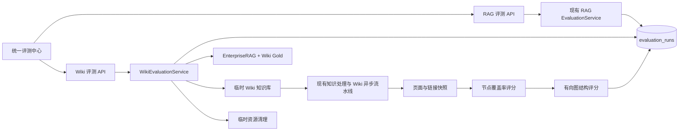
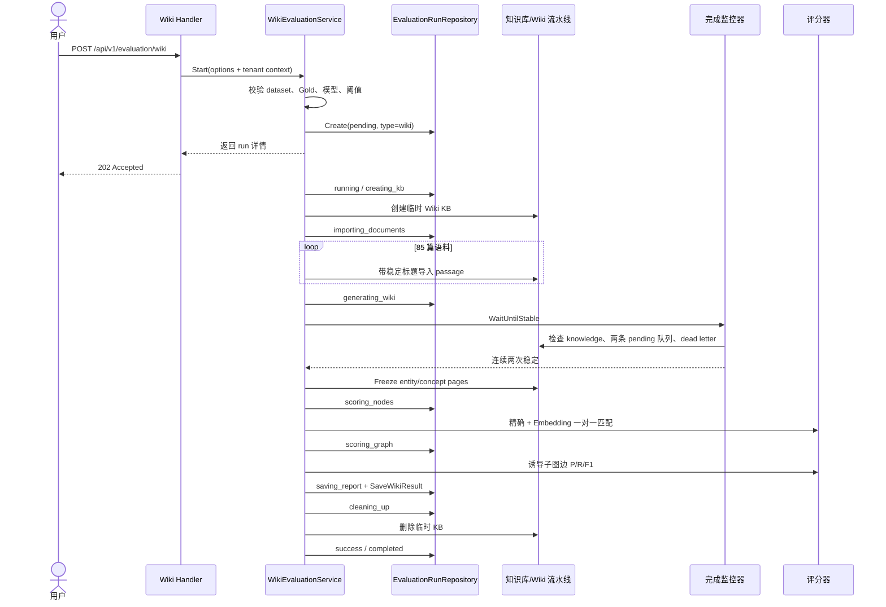

# Wiki 评测与统一评测中心 Plan

> 状态：已批准（2026-09-07，章节逐项确认并最终审批）
> 依据：已批准的 `docs/specs/wiki-evaluation/spec.md`

## 架构概览

本功能采用“共享评测运行底座、RAG 与 Wiki 分别执行”的结构。现有 `evaluation_runs` 继续保存所有评测任务，通过 `evaluation_type` 区分 `rag` 与 `wiki`；现有 RAG 服务、请求结构和指标计算不改。Wiki 使用独立的服务、配置、结果结构和 API，避免把两套执行逻辑耦合成一个通用但难以维护的流程框架。

评测中心页面改成一个轻量外壳，提供“RAG 问答评测”和“Wiki 评测”两个页签。原页面的 RAG 内容迁入独立面板，行为保持一致；Wiki 面板负责配置、启动、阶段进度、历史记录、结果详情和报告下载。两类评测分别运行和展示，不计算跨类型总分。

Wiki 评测由协调器串联已有的真实知识处理链路：校验数据和 Gold、创建租户隔离的临时知识库、逐篇导入 EnterpriseRAG 语料、等待 Wiki 异步任务稳定结束、冻结实体/概念页面和有向链接、执行确定性评分、保存结果和报告数据，最后删除临时知识库。评分模块不调用 Chat 模型；Chat 仅参与已有 Wiki 生成流程，Embedding 仅参与未精确匹配节点的语义匹配。



依赖方向保持单向：HTTP Handler 依赖服务接口，协调器依赖数据加载、知识库、知识导入、完成监控、页面读取、评分、运行仓储和成本统计接口；节点评分依赖一个批量 Embedding 适配器，图评分保持纯计算。RAG 服务不会依赖 Wiki 模块。

## 核心数据结构

### 评测类型、阶段和持久化运行

```go
type EvaluationType string

const (
    EvaluationTypeRAG  EvaluationType = "rag"
    EvaluationTypeWiki EvaluationType = "wiki"
)

type EvaluationStage string

const (
    EvaluationStageValidating    EvaluationStage = "validating"
    EvaluationStageCreatingKB    EvaluationStage = "creating_kb"
    EvaluationStageImporting     EvaluationStage = "importing_documents"
    EvaluationStageGenerating    EvaluationStage = "generating_wiki"
    EvaluationStageScoringNodes  EvaluationStage = "scoring_nodes"
    EvaluationStageScoringGraph  EvaluationStage = "scoring_graph"
    EvaluationStageSavingReport  EvaluationStage = "saving_report"
    EvaluationStageCleaningUp    EvaluationStage = "cleaning_up"
    EvaluationStageCompleted     EvaluationStage = "completed"
)

type EvaluationStageProgress struct {
    Current int    `json:"current"`
    Total   int    `json:"total"`
    Message string `json:"message,omitempty"`
}
```

`types.EvaluationRun` 增加以下字段：

```go
EvaluationType EvaluationType  `gorm:"type:varchar(16);not null;default:rag;index" json:"evaluation_type"`
Stage          EvaluationStage `gorm:"type:varchar(32);not null;default:''" json:"stage,omitempty"`
FailureStage   EvaluationStage `gorm:"type:varchar(32);not null;default:''" json:"failure_stage,omitempty"`
StageProgress  json.RawMessage `gorm:"type:jsonb;default:'{}'" json:"stage_progress,omitempty"`
ResultDetail   json.RawMessage `gorm:"type:jsonb" json:"result_detail,omitempty"`
```

原有 `Status` 仍表示任务总状态，`Stage` 表示 Wiki 当前执行阶段，`FailureStage` 单独保留最初发生业务错误的阶段，原有 `Finished/Total` 继续作为兼容的总体进度。历史 RAG 数据通过数据库默认值自动得到 `evaluation_type=rag`，无需回填业务内容。`Metric` 保存便于列表展示的聚合指标，`ResultDetail` 保存完整 Wiki 明细；两者都只在评分完整结束后一次性提交，避免失败任务出现有效的全零结果。

### Wiki 评测请求与配置快照

```go
type WikiEvaluationOptions struct {
    DatasetID        string  `json:"dataset_id"`
    ChatModelID      string  `json:"chat_id"`
    EmbeddingModelID string  `json:"embedding_id"`
    SemanticThreshold float64 `json:"semantic_threshold"`
}

type WikiEvaluationConfigSnapshot struct {
    Dataset       DatasetSnapshot       `json:"dataset"`
    Gold          WikiGoldSnapshot      `json:"gold"`
    ChatModel     ModelSnapshot         `json:"chat_model"`
    EmbeddingModel ModelSnapshot        `json:"embedding_model"`
    Threshold     float64               `json:"semantic_threshold"`
    Wiki          WikiGenerationSnapshot `json:"wiki"`
    Version       VersionSignature      `json:"version"`
}

type WikiGoldSnapshot struct {
    SchemaVersion string `json:"schema_version"`
    DatasetSHA256 string `json:"dataset_sha256"`
    ContentSHA256 string `json:"content_sha256"`
    NodeCount     int    `json:"node_count"`
    EdgeCount     int    `json:"edge_count"`
}

type WikiGenerationSnapshot struct {
    IndexingStrategy IndexingStrategy `json:"indexing_strategy"`
    WikiConfig       WikiConfig       `json:"wiki_config"`
}
```

阈值缺省为 `0.80`，合法范围为 `[0,1]`。快照中的模型只保存 ID、名称、提供商和类型，不保存密钥。`WikiGenerationSnapshot` 保存本次实际生效的 Wiki 配置和临时知识库索引策略，使历史结果可以解释。

### 数据集文档与 Gold

现有 `EvaluationDataset` 保留 `Pairs`，并增加完整且稳定排序的语料列表：

```go
type EvaluationDocument struct {
    ID      int    `json:"id"`
    Title   string `json:"title"`
    Content string `json:"content"`
}

type EvaluationDataset struct {
    ID          string
    SHA256      string
    SampleCount int
    Pairs       []*QAPair
    Documents   []EvaluationDocument
}
```

EnterpriseRAG 的 85 篇去重语料按 corpus ID 升序加载，标题固定为 `enterprise_rag-corpus-<id>`。现有数据集哈希算法和 RAG `Pairs` 语义保持不变；Wiki 只消费新增的 `Documents`。

Gold 文件为严格 JSON：

```go
type WikiGold struct {
    SchemaVersion string         `json:"schema_version"`
    DatasetID     string         `json:"dataset_id"`
    DatasetSHA256 string         `json:"dataset_sha256"`
    ContentSHA256 string         `json:"content_sha256"`
    Nodes         []WikiGoldNode `json:"nodes"`
    Edges         []WikiGoldEdge `json:"edges"`
}

type WikiGoldNode struct {
    ID      string   `json:"id"`
    Type    string   `json:"type"` // entity | concept
    Name    string   `json:"name"`
    Aliases []string `json:"aliases"`
}

type WikiGoldEdge struct {
    Source string `json:"source"`
    Target string `json:"target"`
}
```

加载器拒绝未知字段、重复节点 ID、空名称、非法类型、重复边和指向不存在节点的边。Gold 自环允许存在，并像其他有向边一样参与评分。`content_sha256` 是将该字段置空后，对规范化 JSON 计算的 SHA-256；`dataset_sha256` 必须等于已加载数据集的哈希。数组在计算内容哈希前按稳定键排序，换行或字段顺序不会改变签名。

### 生成 Wiki 快照

```go
type WikiEvaluationPage struct {
    ID       string   `json:"id"`
    Slug     string   `json:"slug"`
    Title    string   `json:"title"`
    Type     string   `json:"type"` // entity | concept
    Aliases  []string `json:"aliases"`
    OutLinks []string `json:"out_links"`
}
```

冻结器只读取实体页和概念页。页面、别名和链接去重后稳定排序；`OutLinks` 使用解析后的页面 slug，并保留无法解析或指向非评分页面的链接，供详情标注“未参与图评分”的原因。评分开始后不再读取活跃 Wiki 表，以保证页面详情和报告来自同一快照。

### 节点、图和成本结果

```go
type WikiNodeMatch struct {
    GoldNodeID   string   `json:"gold_node_id"`
    GoldType     string   `json:"gold_type"`
    GoldName     string   `json:"gold_name"`
    PageID       string   `json:"page_id,omitempty"`
    PageSlug     string   `json:"page_slug,omitempty"`
    PageTitle    string   `json:"page_title,omitempty"`
    Method       string   `json:"method"` // exact | semantic | unmatched
    Score        *float64 `json:"score,omitempty"`
    Reason       string   `json:"reason,omitempty"`
}

type WikiNodeMetric struct {
    GoldTotal     int     `json:"gold_total"`
    ExactMatched  int     `json:"exact_matched"`
    SemanticMatched int   `json:"semantic_matched"`
    Unmatched     int     `json:"unmatched"`
    Coverage      float64 `json:"coverage"`
}

type WikiEdgeRef struct {
    Source string `json:"source"`
    Target string `json:"target"`
    Reason string `json:"reason,omitempty"`
}

type WikiGraphMetric struct {
    Correct   int     `json:"correct"`
    Missing   int     `json:"missing"`
    Extra     int     `json:"extra"`
    Precision float64 `json:"precision"`
    Recall    float64 `json:"recall"`
    F1        float64 `json:"f1"`
    Scorable  bool    `json:"scorable"`
    Note      string  `json:"note,omitempty"`
}

type WikiEvaluationMetric struct {
    Entity WikiNodeMetric  `json:"entity"`
    Concept WikiNodeMetric `json:"concept"`
    Overall WikiNodeMetric `json:"overall"`
    Graph WikiGraphMetric  `json:"graph"`
    GenerationCost *EvaluationCostMetrics `json:"generation_cost,omitempty"`
    ScoringCost *EvaluationCostMetrics    `json:"scoring_cost,omitempty"`
}

type WikiEvaluationResult struct {
    Metric        WikiEvaluationMetric         `json:"metric"`
    NodeMatches   []WikiNodeMatch              `json:"node_matches"`
    CorrectEdges  []WikiEdgeRef                `json:"correct_edges"`
    MissingEdges  []WikiEdgeRef                `json:"missing_edges"`
    ExtraEdges    []WikiEdgeRef                `json:"extra_edges"`
    UnscoredEdges []WikiEdgeRef                `json:"unscored_edges"`
    FrozenPages   []WikiEvaluationPage         `json:"frozen_pages"`
}

type WikiNodeScore struct {
    Entity       WikiNodeMetric    `json:"entity"`
    Concept      WikiNodeMetric    `json:"concept"`
    Overall      WikiNodeMetric    `json:"overall"`
    Matches      []WikiNodeMatch   `json:"matches"`
    PageToGoldID map[string]string `json:"-"`
}

type WikiGraphScore struct {
    Metric        WikiGraphMetric `json:"metric"`
    CorrectEdges  []WikiEdgeRef   `json:"correct_edges"`
    MissingEdges  []WikiEdgeRef   `json:"missing_edges"`
    ExtraEdges    []WikiEdgeRef   `json:"extra_edges"`
    UnscoredEdges []WikiEdgeRef   `json:"unscored_edges"`
}

type WikiEvaluationDetail struct {
    Run            *EvaluationRun                `json:"run"`
    Params         *WikiEvaluationOptions        `json:"params"`
    ConfigSnapshot *WikiEvaluationConfigSnapshot `json:"config_snapshot,omitempty"`
    Metric         *WikiEvaluationMetric         `json:"metric,omitempty"`
    Result         *WikiEvaluationResult         `json:"result,omitempty"`
}

type WikiEvaluationDatasetMeta struct {
    ID          string           `json:"id"`
    SHA256      string           `json:"sha256"`
    DocumentCount int            `json:"document_count"`
    Gold        WikiGoldSnapshot `json:"gold"`
}

type EvaluationReportFormat string

const (
    EvaluationReportJSON     EvaluationReportFormat = "json"
    EvaluationReportMarkdown EvaluationReportFormat = "markdown"
)
```

聚合值内部保留 `float64` 原精度，API 直接输出原值，前端统一显示四位小数。边集合按 `source,target` 排序，节点明细按类型和 Gold ID 排序，保证相同输入得到稳定报告。

## 核心接口

### Wiki 评测服务

```go
type WikiEvaluationService interface {
    Start(ctx context.Context, opts *types.WikiEvaluationOptions) (*types.WikiEvaluationDetail, error)
    Get(ctx context.Context, runID string) (*types.WikiEvaluationDetail, error)
    ListDatasets(ctx context.Context) ([]*types.WikiEvaluationDatasetMeta, error)
    ListRuns(ctx context.Context, status *types.EvaluationStatue, p *types.Pagination) (*types.PageResult, error)
    RenderReport(ctx context.Context, runID string, format types.EvaluationReportFormat) ([]byte, string, error)
    DeleteRun(ctx context.Context, runID string) error
}
```

`Start` 在返回前完成租户、数据、Gold、模型和参数校验，校验失败不创建运行记录或临时资源。校验通过后先持久化 `pending` 记录，再启动后台协调器。`Get/ListRuns/RenderReport/DeleteRun` 均从请求上下文取得 tenant ID，并通过租户条件查询。

### Gold、导入、监控与冻结

```go
type WikiGoldLoader interface {
    Load(ctx context.Context, dataset *types.EvaluationDataset) (*types.WikiGold, error)
}

type WikiCorpusImporter interface {
    ImportDocuments(ctx context.Context, tenantID uint64, kbID string, docs []types.EvaluationDocument) ([]string, error)
}

type TitledPassageKnowledgeCreator interface {
    CreateKnowledgeFromPassageWithTitle(ctx context.Context, kbID string, title string, passages []string, channel string) (*types.Knowledge, error)
}

type WikiGenerationMonitor interface {
    WaitUntilStable(ctx context.Context, tenantID uint64, kbID string, knowledgeIDs []string, onProgress func(types.EvaluationStageProgress)) error
}

type WikiPageFreezer interface {
    Freeze(ctx context.Context, tenantID uint64, kbID string) ([]types.WikiEvaluationPage, error)
}
```

导入器在已有 passage 创建链路上补充稳定标题入口，每篇语料对应一条 knowledge，返回全部 ID。监控器检查这些 knowledge 的终态、`wiki:ingest` 与 `wiki:finalize` 两条 `task_pending_ops` 队列、对应 dead-letter 记录；全部完成、两条队列为空且无 dead letter 的条件连续观察两次后才返回成功。

### 评分与报告

```go
type WikiEvaluationScorer interface {
    ScoreNodes(ctx context.Context, gold *types.WikiGold, pages []types.WikiEvaluationPage, embeddingModelID string, threshold float64) (*types.WikiNodeScore, error)
    ScoreGraph(gold *types.WikiGold, pages []types.WikiEvaluationPage, nodes *types.WikiNodeScore) *types.WikiGraphScore
}

type WikiEmbeddingProvider interface {
    Embed(ctx context.Context, modelID string, texts []string) ([][]float32, error)
}

type WikiEvaluationReportRenderer interface {
    JSON(detail *types.WikiEvaluationDetail) ([]byte, error)
    Markdown(detail *types.WikiEvaluationDetail) ([]byte, error)
}
```

`ScoreNodes` 除批量 Embedding 调用外不访问外部状态；`ScoreGraph` 是纯函数。报告渲染器只读取已经持久化的运行、快照、指标和明细，页面详情与下载文件不会重新评分。

### 运行仓储扩展

现有 `EvaluationRunRepository` 保留所有已有方法，并增加：

```go
ListByType(ctx context.Context, tenantID uint64, evaluationType types.EvaluationType, status *types.EvaluationStatue, p *types.Pagination) ([]*types.EvaluationRun, int64, error)
UpdateStage(ctx context.Context, id string, stage types.EvaluationStage, progress types.EvaluationStageProgress) error
RecordFailure(ctx context.Context, id string, failureStage types.EvaluationStage, errMsg string) error
SaveWikiResult(ctx context.Context, id string, metric json.RawMessage, resultDetail json.RawMessage, configSnapshot json.RawMessage) error
ListCleanupPending(ctx context.Context, evaluationType types.EvaluationType) ([]*types.EvaluationRun, error)
```

旧 `List` 继续表示 RAG 列表，确保原 handler 和内部调用无行为变化。`SaveWikiResult` 在单个事务中写入聚合指标、详情和最终快照。状态转换继续使用 compare-and-swap，避免后台任务、重启恢复和删除操作互相覆盖。

## 模块设计

### 1. 共享评测运行底座

**职责：** 扩展 `evaluation_runs` 的类型、阶段、原始失败阶段和 Wiki 明细字段；提供类型过滤、阶段更新、失败记录、原子保存结果和待清理任务查询。

**依赖：** GORM、PostgreSQL/SQLite 迁移。

**兼容规则：** 新列有安全默认值；旧记录统一视为 RAG；旧列表 API 不带类型时仍只返回 RAG，防止现有前端突然混入无法解析的 Wiki 指标。

### 2. EnterpriseRAG 数据和 Wiki Gold 加载器

**职责：** 在现有 parquet 加载结果中保留完整的 85 篇去重语料；加载、严格校验和签名 `wiki_gold.json`；返回适合选择器的 dataset/Gold 元数据。

**依赖：** 现有 `DatasetService`、SHA-256、JSON 解码器。

**校验顺序：** 数据集存在且有效 → Gold 文件存在 → JSON schema 合法 → 引用完整 → Gold 内容哈希正确 → 数据集 ID/哈希一致。错误信息包含失败项和实际值，不进入后台任务。

### 3. Wiki 评测协调器

**职责：** 管理一次 Wiki 运行的阶段、超时、错误、结果提交和清理；设置模型调用归属；调用其余窄接口。

**依赖：** 运行仓储、数据/Gold 加载、模型服务、知识库服务、导入器、监控器、冻结器、评分器、成本统计、报告数据组装器。

**运行限制：** 每次运行最长 4 小时；使用现有模型并发控制和 Wiki worker 池，不另建无上限 goroutine 池。协调器在每次阶段变化和周期性等待时刷新 heartbeat。

### 4. 临时知识库创建与语料导入

**职责：** 创建只属于当前租户和当前 run 的文档知识库，逐篇导入数据集并记录 knowledge ID。

**配置：** `IndexingStrategy{VectorEnabled:false, KeywordEnabled:false, WikiEnabled:true, GraphEnabled:false}`；`SummaryModelID` 使用所选 Chat 模型；`EmbeddingModelID` 记录所选评分模型，但导入阶段不启用向量或关键词索引。该组合会生成 Wiki 所需 chunks，同时避免无关索引调用。

**实现约束：** 增加带标题的 passage 导入入口并复用现有创建、分块和 post-process 链路，不复制知识处理逻辑。文档按 ID 顺序导入；部分导入失败时立即停止，交由统一清理删除已创建内容。

### 5. Wiki 完成监控

**职责：** 判定异步 Wiki 生成是否真正完成，更新导入/生成进度，发现处理失败、dead letter 和超时。

**完成条件：** 所有本次 knowledge 都处于成功终态；本 KB 的 `wiki:ingest` 和 `wiki:finalize` pending/claimed 数均为 0；两类 dead-letter 均为 0；上述条件连续两轮成立。轮询间隔使用固定短间隔并响应 context 取消。

**失败条件：** 任一 knowledge 进入失败终态、任一 Wiki dead-letter 出现、知识库被外部删除或达到 4 小时总超时。错误中保留 knowledge/task 标识。

### 6. Wiki 页面冻结器

**职责：** 在生成稳定后按 tenant + KB 查询页面，筛选 entity/concept，规范化别名和出链，生成不可变、稳定排序的评分快照。

**依赖：** Wiki page repository/service。

**边界：** 摘要、索引、综合、对比等页面不进入节点候选；指向它们、未知 slug 或未匹配页面的链接保留为 unscored 详情。

### 7. 节点匹配与覆盖率

**职责：** 计算实体、概念和总体覆盖率，并生成逐节点解释。

**规范化：** 名称和别名先执行 Unicode NFKC，再做 Unicode case fold、去除两端标点和空白、将内部连续空白折叠为一个空格。空字符串不参与匹配。为此将已有的 `golang.org/x/text` 从间接依赖转为直接依赖。

**精确阶段：** 只连接同类型节点；Gold 名称/任一别名与页面标题/任一别名规范化后相等即为候选。按稳定排序执行最大基数二分图匹配，解决重名和多别名冲突。

**语义阶段：** 仅处理双方未匹配节点，并继续限制同类型。对去重后的名称/别名批量取 Embedding，每对节点取两侧名称集合的最大余弦相似度。低于阈值的边先删除，再通过本地实现的确定性最大权一对一分配选取匹配；相同总权重时按 Gold ID、页面 slug 的词典序打破平局。

**指标：** 每类 `coverage=(exact+semantic)/gold_total`，总体按节点数汇总后计算，而非两类覆盖率的简单平均。生成的额外页面不降低覆盖率，但会保留在快照中供排查。

### 8. 有向图评分

**职责：** 把已匹配页面映射到 Gold 节点，在这些节点的诱导子图上比较去重后的有向边集合。

**计算：** `correct=generated ∩ gold`，`missing=gold-generated`，`extra=generated-gold`；`precision=correct/(correct+extra)`，`recall=correct/(correct+missing)`，`F1=2PR/(P+R)`。方向相反的边视为不同边。

**零分母：** 分母为零时对应数值输出 0；当诱导子图没有可评分 Gold 边且没有生成边时设置 `scorable=false`，并输出“无可评分边”，避免把 0 误解为质量失败。任一端点未匹配、非评分页面或无法解析的链接不参与 P/R/F1，并进入 `UnscoredEdges`。

Gold 和生成结果中的自环都按普通有向边参与集合比较；重复链接在比较前折叠为一条边。

### 9. 异步模型调用归属

**职责：** 让跨 asynq 和 Wiki pending-op 的模型调用保留评测 run 归属，并区分生成与评分成本。

**实现：** `types.TracingContext` 增加不含敏感信息的 `RequestGroupID`；`langfuse.InjectTracing` 无论 Langfuse 是否启用都注入该字段，worker middleware 无论是否存在 traceparent 都恢复它；Wiki ingest/finalize pending payload 同样携带并恢复该字段。生成阶段使用 `<runID>:generation`，评分阶段使用 `<runID>:scoring`。成本汇总分别按两个精确 group ID 查询，不依赖前缀猜测。

### 10. 结果持久化和报告

**职责：** 将指标、节点/边明细、冻结页面、配置签名和分阶段成本一次性持久化；从持久化数据渲染 JSON/Markdown。

**一致性：** JSON 报告采用与详情 API 相同的结构；Markdown 以相同对象渲染摘要表和明细表。报告请求不会读取临时 KB，因此清理后仍可下载。失败发生在评分完成前时 `Metric` 和 `ResultDetail` 保持空；错误、阶段、配置快照仍可查询。

### 11. 清理与重启恢复

**职责：** 成功和失败路径都删除临时知识库及其关联任务；服务启动时处理中断任务和遗留资源。

**顺序：** 成功路径先保存评分结果，再进入清理阶段，删除成功后才转 `success`；业务失败先写入 `FailureStage` 和原因，再清理，删除成功后才转 `failed`。清理使用独立于 4 小时执行超时的新 context。清理失败时任务保持在 `running/cleaning_up`，同时记录业务错误与清理错误，由后台恢复器重试；不会在临时资源仍存在时声明终态。服务重启会将非清理阶段的陈旧运行记为 interrupted 原因并转入清理；清理完成后保留原失败/中断信息。

### 12. HTTP 与前端

**职责：** 提供 Wiki 独立 API；将评测中心拆成共享外壳、RAG 面板、Wiki 面板、共享历史表和 Wiki 详情组件。

**列表兼容：** 现有 `EvaluationHandler.GetEvaluationRuns` 增加 `evaluation_type` 解析，并注入 Wiki 服务；值为空或 `rag` 时仍调用现有 RAG 列表方法，值为 `wiki` 时调用 `WikiEvaluationService.ListRuns`，其他值返回 400。共享删除入口继续复用现有按 tenant 查询、终态检查和临时 KB 清理逻辑。

**前端状态：** 页签状态和两类表单、轮询、历史分页互相独立；Wiki 运行时展示 `stage + stage_progress`，成功后展示覆盖率与图指标卡片，下钻节点/边明细并下载报告。失败时突出失败阶段与原始错误，不展示空指标卡。

## 模块交互

### 启动和成功流程



前端启动后立即获得 run ID，并按现有轮询方式查询详情。协调器在后台执行，HTTP 请求取消不会取消已接受的任务；4 小时运行上下文由服务创建。轮询只读持久化状态，因此刷新页面可继续观察。

### 失败和恢复流程

1. 同步校验失败：返回 4xx 和明确错误，不创建 run 或 KB。
2. 后台业务失败：保存最初失败的 `stage` 和错误，清空未完成的质量结果，转入 `cleaning_up`。
3. 清理成功：任务转 `failed`，保留原失败阶段、错误、配置快照和可用的调用成本。
4. 清理暂时失败：记录组合错误并保持清理中，由启动恢复器和周期恢复逻辑按 `TemporaryKBID` 重试。
5. 服务重启：原 RAG stale 处理保持原行为；Wiki stale 运行先停止继续评分，标记 interrupted 原因并进入相同清理流程。
6. 删除历史：只允许删除终态且属于当前租户的 run；临时资源存在时拒绝删除记录，避免失去清理索引。

## HTTP API

现有 RAG 接口保持原请求和响应：

- `POST /api/v1/evaluation`
- `GET /api/v1/evaluation?task_id=:id`
- `GET /api/v1/evaluation/datasets`
- `GET /api/v1/evaluation/runs`
- `DELETE /api/v1/evaluation/runs/:id`

新增 Wiki 接口：

- `POST /api/v1/evaluation/wiki`：同步校验并启动，返回 202 与 Wiki detail。
- `GET /api/v1/evaluation/wiki/:id`：返回当前租户的阶段、指标、详情和错误。
- `GET /api/v1/evaluation/wiki/datasets`：返回可用数据集及 Gold 版本/哈希。
- `GET /api/v1/evaluation/runs?evaluation_type=wiki`：按类型列出历史；不传参数时默认 `rag`。
- `GET /api/v1/evaluation/wiki/runs/:id/report?format=json|markdown`：下载持久化报告。
- `DELETE /api/v1/evaluation/runs/:id`：复用共享删除接口，服务按 run 类型校验终态。

错误响应继续使用项目统一错误格式。无效参数、Gold 不一致和模型类型错误返回 400；租户范围外的 run 返回 404；运行中删除返回 409；内部执行错误写入 run 后由详情接口呈现。

## 数据库迁移

PostgreSQL `000096` 与 SQLite `000018` 执行等价变更：

1. 为 `evaluation_runs` 增加 `evaluation_type`，非空、默认 `rag`，并建立 `(tenant_id, evaluation_type, created_at)` 索引。
2. 增加 `stage` 和 `failure_stage`，非空、默认空字符串。
3. 增加 `stage_progress`，默认空 JSON 对象。
4. 增加 `result_detail`，允许为空。
5. down migration 删除索引和新增列；SQLite 按项目既有迁移约定处理不支持的列删除操作。

不创建新的 Wiki 专用运行表。完整明细以 JSON 保存，与当前 `Params/Metric/ConfigSnapshot` 的持久化方式一致；首期固定数据规模下可避免跨多表写入中间态导致的不一致。

## 前端设计

`EvaluationCenterSettings.vue` 只负责页签、标题和两个面板的挂载。现有 RAG 表单、运行轮询和指标展示整体迁入 `RagEvaluationPanel.vue`，迁移时不改字段默认值和 API。

`WikiEvaluationPanel.vue` 包含：

- 数据集、Chat 模型、Embedding 模型和阈值表单；默认阈值 0.80。
- 启动前表单校验及后端校验错误展示。
- 当前任务阶段条，展示数据准备、导入、生成、节点评分、图评分、保存、清理。
- 实体、概念、总体覆盖率卡和图 Precision/Recall/F1 卡。
- 生成成本和评分成本两组独立统计。

`EvaluationHistoryTable.vue` 通过 props 接收评测类型、列定义和操作回调，复用分页、状态、删除和查看操作，不解释具体指标。`WikiEvaluationDetail.vue` 提供节点和边两个明细区：节点可按类型/匹配方式过滤；边可按正确、缺失、多余、未评分过滤。JSON/Markdown 下载直接调用报告 API。

`wikiEvaluationViewModel.ts` 只负责状态标签、阶段文案、百分比、四位小数和空指标判断，避免模板中重复推导。页面刷新时从后端详情恢复，不依赖浏览器内存保存结果。

## 文件组织

```text
dataset/enterprise_rag/
└── wiki_gold.json                                  — 版本化实体、概念与有向边 Gold

migrations/versioned/
├── 000096_wiki_evaluation_runs.up.sql             — PostgreSQL 运行表扩展
└── 000096_wiki_evaluation_runs.down.sql
migrations/sqlite/
├── 000018_wiki_evaluation_runs.up.sql             — SQLite 等价迁移
└── 000018_wiki_evaluation_runs.down.sql

internal/types/
├── evaluation.go                                  — 共享运行字段、数据集 Documents
├── wiki_evaluation.go                             — Wiki 请求、Gold、快照、指标、详情
└── tracing.go                                     — 异步 RequestGroupID carrier
internal/types/interfaces/
└── evaluation.go                                  — Wiki 服务/评分接口与仓储扩展

internal/application/service/
├── evaluation.go                                  — 保持 RAG 行为并显式使用 rag 类型
├── dataset.go                                     — 保留完整稳定语料列表
├── dataset_test.go                                — 语料顺序、去重和哈希兼容测试
├── knowledge_create.go                            — 新增带标题 passage 导入入口
├── knowledge_create_test.go                       — 带标题 passage 兼容测试
├── wiki_ingest.go                                 — Wiki pending-op 调用归属传播
├── wiki_ingest_test.go                            — pending-op 调用归属测试
├── wiki_evaluation.go                             — 启动、协调、失败与清理
├── wiki_evaluation_gold.go                        — Gold 严格校验与签名
├── wiki_evaluation_import.go                      — 临时 KB 与 85 篇语料导入
├── wiki_evaluation_wait.go                        — knowledge/queue/dead-letter 稳定监控
├── wiki_evaluation_freeze.go                      — 实体/概念页面与出链冻结
├── wiki_evaluation_match.go                       — 名称规范化与一对一节点匹配
├── wiki_evaluation_graph.go                       — 诱导子图有向边指标
├── wiki_evaluation_report.go                      — JSON/Markdown 报告
├── wiki_evaluation_test.go                        — 协调、失败与清理测试
├── wiki_evaluation_gold_test.go                   — Gold/hash 测试
├── wiki_evaluation_import_test.go                 — 临时 KB 配置与部分导入失败测试
├── wiki_evaluation_wait_test.go                   — 队列稳定、dead letter、超时测试
├── wiki_evaluation_freeze_test.go                 — 页面过滤、链接保留与排序测试
├── wiki_evaluation_match_test.go                  — 精确/语义/类型/阈值测试
├── wiki_evaluation_graph_test.go                  — 图指标及边界测试
└── wiki_evaluation_report_test.go                 — 双格式一致性测试

internal/application/repository/
├── evaluation_run.go                              — 类型列表、阶段、原子结果、清理查询
└── evaluation_run_test.go                         — 租户、兼容、事务测试
internal/tracing/langfuse/
├── asynq.go                                       — 独立传播 trace 与 request group
└── asynq_test.go                                  — Langfuse 关闭时仍传播的测试
internal/handler/
├── evaluation.go                                  — 共享列表类型过滤兼容
├── evaluation_test.go                             — RAG 默认过滤兼容测试
├── wiki_evaluation.go                             — Wiki 启动、详情、数据集、报告
└── wiki_evaluation_test.go                        — 参数、租户、状态码和报告测试
internal/container/
├── container.go                                   — Wiki 服务与 handler 注入
├── recover_evaluation_runs.go                     — 中断 Wiki 清理恢复
└── recover_evaluation_runs_test.go                — 重启恢复与遗留 KB 清理测试
internal/router/
├── routes_infra.go                                — Wiki 路由注册
└── router_api_key_capabilities_test.go            — Wiki 路由权限测试

frontend/src/api/evaluation/
└── index.ts                                       — Wiki DTO 和 API
frontend/src/views/settings/
├── EvaluationCenterSettings.vue                   — 双页签外壳
└── evaluation/
    ├── RagEvaluationPanel.vue                     — 现有 RAG 页面内容
    ├── WikiEvaluationPanel.vue                    — Wiki 配置、运行与指标
    ├── EvaluationHistoryTable.vue                 — 共享历史表
    ├── WikiEvaluationDetail.vue                   — 节点/边下钻和报告下载
    ├── wikiEvaluationViewModel.ts                 — 展示映射
    └── wikiEvaluationViewModel.test.ts            — 阶段与格式化测试
frontend/src/i18n/locales/
├── zh-CN.ts                                       — Wiki 评测中文文案
├── en-US.ts                                       — 英文文案及 locale 审计兼容
├── ko-KR.ts                                       — 韩文键集合兼容
└── ru-RU.ts                                       — 俄文键集合兼容

docs/api/evaluation.md                             — Wiki API 与报告格式
website-docs/03-features/15-evaluation.md          — 用户操作和指标解释
docs/specs/wiki-evaluation/
├── spec.md
├── plan.md
├── task.md                                        — 下一阶段生成
└── checklist.md                                   — task 审批后生成

go.mod                                             — 将 golang.org/x/text 标为直接依赖
go.sum                                             — 仅在依赖整理产生变化时更新
```

## 技术决策

| 决策点 | 选择 | 理由 |
|---|---|---|
| 运行存储 | 扩展共享 `evaluation_runs` | 复用状态、心跳、租户和历史能力，同时用独立结果结构隔离 Wiki 逻辑 |
| RAG 兼容 | 旧列表默认 `rag`，旧服务接口保持可用 | 避免旧页面和调用方读到不兼容指标 |
| Gold 格式 | 仓库内严格 JSON，显式 schema/dataset/content 签名 | 易审核、可版本化、启动前可确定性校验 |
| 评测语料 | 导入全部 85 篇去重 corpus 文档 | Wiki 需要完整文档上下文，不能只导入 QA 命中的片段 |
| Wiki 输入 | 每次创建租户隔离临时 KB | 可重复、不会污染正式知识库，运行配置可固定 |
| 临时索引 | 仅启用 Wiki，关闭 vector/keyword/graph | 保留 Wiki 所需 chunks，避免无关索引成本和图抽取混入 |
| 完成判定 | knowledge 成功 + ingest/finalize 队列为空 + 无 dead letter，连续两次 | 避免在防抖 finalize 或任务交接窗口中提前冻结 |
| 运行上限 | 4 小时 | 适配完整 Wiki 生成，同时给失控任务明确终点 |
| 名称规范化 | NFKC + case fold + 两端标点/空白清理 + 空白折叠 | 覆盖中英文常见等价写法，保持规则可解释 |
| 精确匹配 | 同类型最大基数一对一匹配 | 处理别名冲突，并优先消耗无需模型判断的确定命中 |
| 语义匹配 | 别名最大余弦 + 阈值过滤 + 最大权一对一分配 | 防止重复覆盖，在全局上选择相似度最高的合法组合 |
| 分配算法 | 本地确定性实现 | 当前规模小，无需新增大型运行时依赖，便于固定平局规则 |
| 节点指标 | 实体/概念/总体 Gold coverage | 对准“关键内容有没有抽出”的首期目标，不用额外页面惩罚覆盖率 |
| 图指标 | 已匹配节点诱导子图的有向边 P/R/F1 | 将节点缺失交给 coverage，避免图指标重复计罚 |
| 零分母 | 数值为 0，并显式 `scorable=false` | API 保持数值类型，同时避免 UI 把无样本误读为零质量 |
| Embedding 调用 | 文本去重、按 `BATCH_EMBED_SIZE` 分批、同运行缓存 | 适配不同 Provider 的批量上限，节点和详情复用同一结果 |
| 模型归属 | `<runID>:generation` 与 `<runID>:scoring` | 可以独立统计 Chat 生成和 Embedding 评分成本 |
| 结果保存 | 结构化 JSON 持久化，报告按需渲染 | 临时 KB 删除后仍可查询，页面与下载使用同一事实源 |
| 成功顺序 | 保存结果 → 删除临时 KB → success | 不因先清理而丢失结果，也不在资源仍存在时报告完成 |
| 失败顺序 | 保存失败原因 → 重试清理 → failed/interrupted | 保留最初故障，且终态符合临时资源已清理约束 |
| 前端结构 | 外壳 + 两个独立面板 + 共享历史表 | 保持 RAG 行为，控制大组件体积，并复用真正相同的列表行为 |
| 交付方式 | 手动实验功能，不接 CI | 符合本期定位，模型波动不会阻断合并和发布 |

## Spec 覆盖检查

| Spec | 设计归属 |
|---|---|
| F1 | 数据和 Gold 加载器、签名校验、`wiki_gold.json` |
| F2 | 双页签评测中心、两套独立面板 |
| F3 | 共享底座兼容规则、RAG 面板原样迁移 |
| F4 | `WikiEvaluationOptions`、同步模型/阈值校验 |
| F5 | 协调器、临时 KB、真实 Wiki 流水线、冻结器 |
| F6 | `EvaluationStage`、持久化阶段、前端阶段条 |
| F7 | 页面过滤、规范化、精确与语义一对一匹配 |
| F8 | `WikiNodeMetric` 和三类 coverage 计算 |
| F9 | 诱导子图有向边集合及 P/R/F1 |
| F10 | 节点、正确/缺失/多余/未评分边明细 |
| F11 | 共享运行仓储、类型过滤、租户查询 |
| F12 | 持久化结果与 JSON/Markdown 渲染器 |
| F13 | 两阶段 request group、分开模型和成本快照 |
| F14 | 协调器失败路径、清理阶段和重启恢复 |

## 设计自检

- **Spec 覆盖：** F1-F14 均有明确模块、数据结构和交互归属，没有缺口。
- **接口完整性：** 启动、加载、导入、等待、冻结、评分、持久化、报告和清理均有可独立实现的接口或仓储方法。
- **依赖清晰度：** RAG 与 Wiki 执行器只共同依赖运行仓储；纯评分模块不反向依赖协调器、HTTP 或数据库，不形成环。
- **矛盾检查：** 评分阶段无 Chat 调用；图指标不重复惩罚未覆盖节点；临时资源清理后报告仍可用；功能不进入 CI。
- **占位符检查：** 文档没有 TBD、TODO、模糊文件落点或未定指标。
